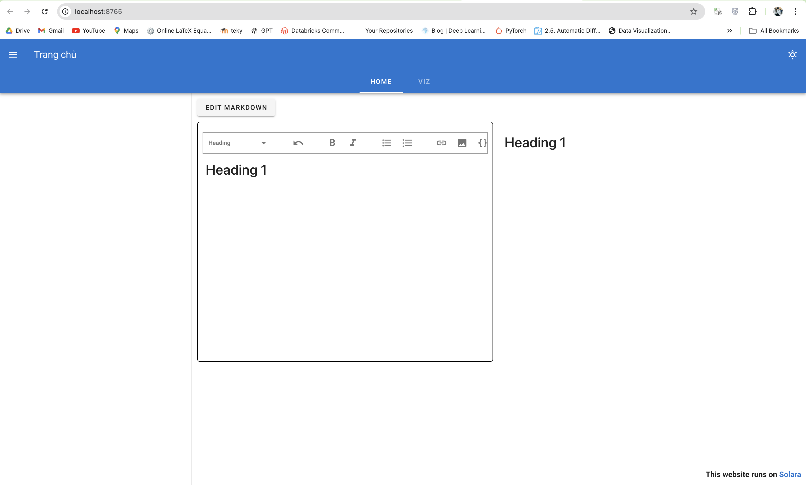

# How to run web

Remember install dependencies in `requirements.txt`:
```bash
pip install -r requirements.txt
```

clone source code:
```bash
git clone https://github.com/ducphuc2303/solara.git
```

Open folder `solara` and run:
```bash
solara run main.py
```

Results:


